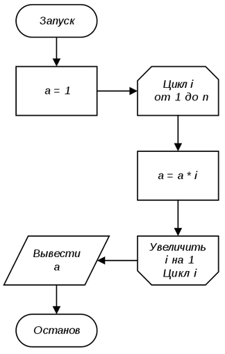

# Алгоритм. Блок-схема

* **Алгоритм** — последовательность действий, приводящая к желаемому результату
* **Блок-схема** — визуальный способ отображения алгоритма

<figure><figcaption>
<em>Пример блок-схемы для программы деления двух чисел</em>
</figcaption></figure>

* [Подробнее о блок-схемах](https://ru.wikipedia.org/wiki/%D0%91%D0%BB%D0%BE%D0%BA-%D1%81%D1%85%D0%B5%D0%BC%D0%B0)
* [Сервис для рисования блок-схем без регистрации](https://programforyou.ru/block-diagram-redactor)
