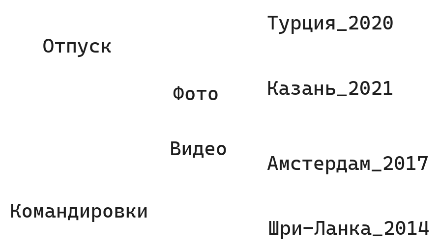

---
layout:
  title:
    visible: true
  description:
    visible: true
  tableOfContents:
    visible: true
  outline:
    visible: true
  pagination:
    visible: true
---

# Файл-менеджмент

Именование файлов

1. Рекомендовано называть файлы и каталоги на латинице и без пробелов

```
C:\Documents\Newstellers\Summer2018.pdf
C:\Program_Files\Custom_Utilities\StringFinder.exe
C:\Python\Lessons\Practice\strings_1.py
```

* Почему?
  * для русского языка есть много кодировок, каждая отдельная программа может по-разному обработать кириллический символ, что может привести к непредвиденному результату

2. Не используйте пробел — он может по разному трактоваться разными программами. Разделяйте слова символами "\_" или "-".
3. Используйте осмысленные английские названия — с вашими программами могут работать другие пользователи и разработчики, в том числе не знающие русского. Английский — универсальный язык.

```
Хорошо: C:\python\lessons\strings.py
Плохо: С:\piton\uroki\stroki.py
```

#### Бекап

* будьте готовы к отключению питания — настройте автосохранение, если оно не настроено
* будьте готовы к поломке машины — пользуйтесь облачными сервисами, сохраняйте копии на сменных носителях

#### Организация каталогов

<figure><figcaption><p><em>Интерактив</em> — <em>как можно организовать эти каталоги фото и видео?</em> </p></figcaption></figure>

* Важно продумывать структуру при организации проектов и личных документов. Учтите масштабируемость.&#x20;

### Практика

* Организуйте свои файлы и каталоги в соответствии с рекомендациями
* Продумайте бекап, ознакомьтесь с возможностями сервисов
* Соблюдайте правила именования файлов, особенно тех, которые вы используйте для работы и учёбы
