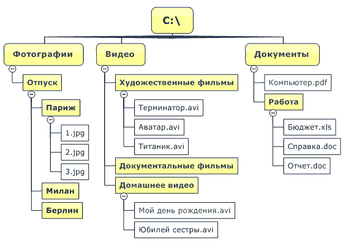

# Введение

**Файловая система** — компонент операционной системы, обеспечивающий организацию создания, хранения и доступа к именованным наборам данных. Эти именованные наборы данных называются **файлами**

<figure><figcaption><p>Пример организации файловой системы в Windows</p></figcaption></figure>

### Доступ к файлам в Python

Когда программе нужно сохранить данные для дальнейшего использования, она  пишет эти данные в файл. Позднее их можно прочитать из файла.

Данные, записанные в файл, остаются доступными **после окончания работы программы.**

Процесс сохранения данных в файле — **запись данных в файл**. Когда часть данных пишется в файл, она _копируется из переменной_, находящейся в ОЗУ (оперативной памяти компьютера), в файл. Файл, в который данные сохраняются, называется **файлом вывода.**

Процесс извлечения данных из файлов — **чтение данных из файла**. Когда порция данных считывается из файла, она _копируется из файла в ОЗУ_, где на неё ссылается переменная. Такой файл называется **файлом ввода** — из него извлекаются входные данные.

При работе с файлами, всегда выполняется три шага:

1. **Открыть файл** — создается связь между файлом и программой — _открытие_ _потока_
2. **Обработать файл** — данные записываются в файл, либо считываются из файла
3. **Закрыть файл** — разрыв связи между файлом и программой — _закрытие_ _потока_

Как это устроено — более подробно:&#x20;

* При работе с файлом, находящимся на диске компьютера, программа создаёт _**файловый объект**_ — программный объект, который связан с определенным файлом и предоставляет программе _**методы**_ для работы с этим файлом.&#x20;
* В программе на файловый объект ссылается переменная. Она используется для осуществления любых операций, которые выполняются с файлом.&#x20;

### Имена файлов. Пути — абсолютный и относительный

Файлы определяются при помощи _имени_. После точки в имени идёт _расширение файла_ — его тип. Благодаря расширению операционная система понимает, как нужно работать с этим файлом.

```
sometext.txt
document.docx
cat.jpg
```

_Полный_ или _абсолютный путь_ — это путь, который указывает на одно и то же место в файловой системе, вне зависимости от текущего рабочего каталога или других обстоятельств.&#x20;

Полный путь всегда начинается с _корневого каталога_. _Относительный_ путь представляет собой путь по отношению _к текущему рабочему каталогу пользователя_

* Абсолютный путь в Windows

```
C:\Work\Media\article.txt 
```

* Абсолютный путь в  UNIX-подобных системах (MacOS, Linux)

```
/Work/Media/article.txt
/Users/mike/Documents/Notes/index.html
/Users/mike/Documents/Notes/style.css
/Users/mike/Documents/Notes/script.js
```

* Относительные пути. Мы указываем их, когда все файла лежат в одной директории и нам нужно получить доступ из неё.

```
index.html
style.css
script.js
```

* Если нужно подняться на шаг выше — `../data.json`&#x20;
* Подняться и зайти в папку `Documents` , где расположен нужный файл: `../Documents/test.txt`

#### Когда какой путь использовать

Общее правило будет такое: если вы работаете со своими файлами, лучше указывать относительный путь, а если нужен чужой файл из интернета — то абсолютный.

#### Методы доступа к файлам

1. **Последовательный доступ** — последовательное обращение к данным, с самого начала файла и до его конца. Перескочить непосредственно к нужным данным не получится. Пример: текстовые файлы
2. **Прямой (произвольный) доступ** — можно непосредственно перескочить к любой порции данных в файле, не читая данные, которые идут перед ней. Это подобно тому, как работает проигрыватель компакт-дисков или MP3-плеер

Мы будем рассматривать _файлы с последовательным доступом_

