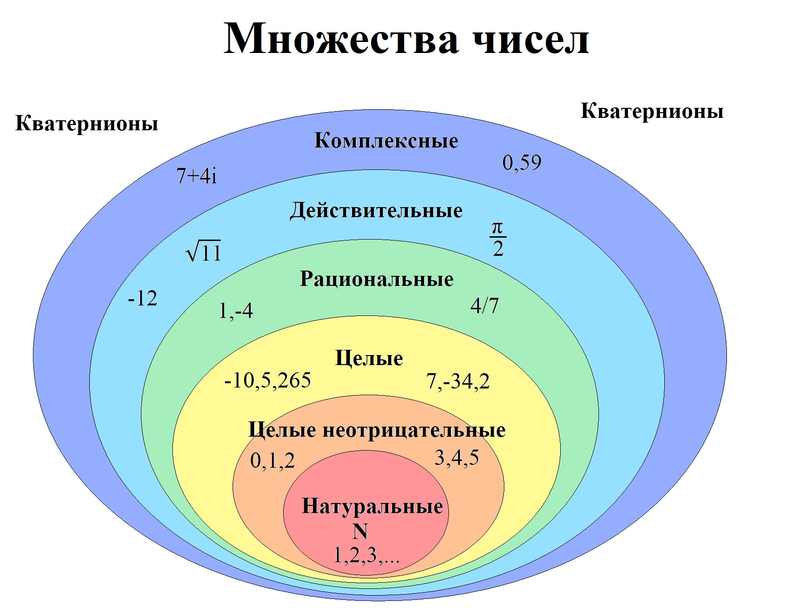
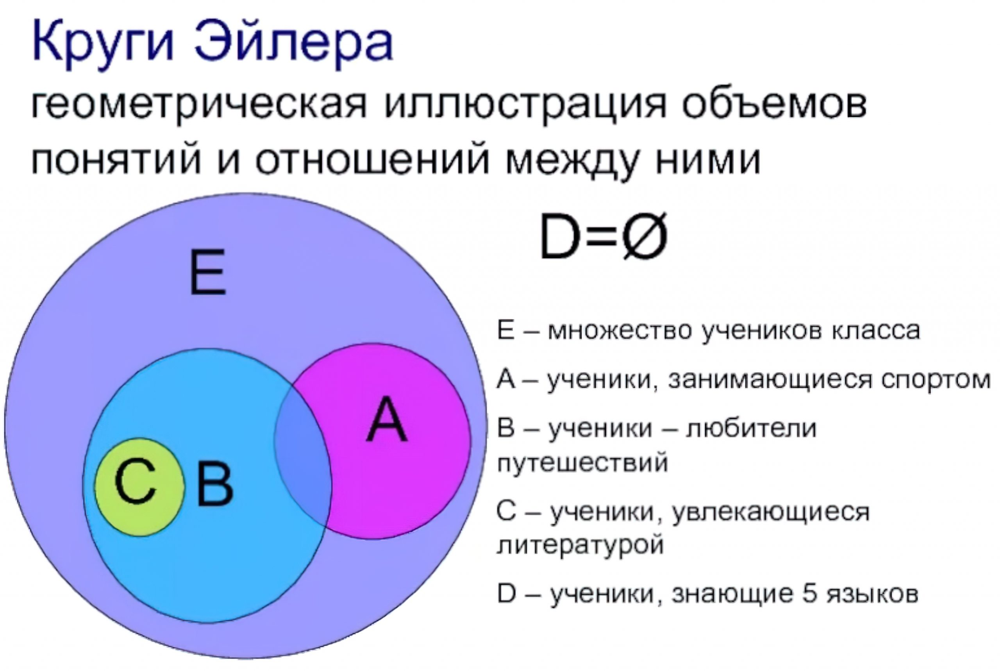

# Множества

**Множество** — это объект, который хранит коллекцию данных таким же образом, что и математические множества

<figure><figcaption><p>Пример множества чисел</p></figcaption></figure>

<figure><figcaption><p>Визуализация взаимоотношений между множествами</p></figcaption></figure>

* Все элементы в множестве должны быть _уникальными._ Никакие два элемента не могут иметь одинаковое значение
* Множества не упорядочены, т.е. элементы в множестве не хранятся в каком-то определенном порядке
* Хранящиеся в множестве элементы могут иметь разные типы данных, но обязательно **они должны быть неизменяемыми**

```python
{1, 2, 3, 4, 5, 6} # множество
```

#### Создание множества


```python
myset = {1, 2, 3, 4, 5, 6}
myset = {} # ТАК НЕ РАБОТАЕТ -- создастся словарь
myset = set() # теперь myset ссылается на пустое множество
myset = set(['a', 'b', 'c', 'd']) 
myset = set('abc')
# в функцию set можно передать любой итерируемый объект
myset = set('abcabc') # мы знаем, что множества могут содержать только уникальные элементы. Попробуйте воспроизвести эту инструкцию локально
myset = set('one', 'two', 'three', 'four') # ОШИБКА - set ожидает один аргумент - итерируемый объект
myset = set(['one', 'two', 'three', 'four']) # теперь работает
```


* Получение количества элементов в множестве

```python
len({1, 2, 3, 4, 5, 6}) # 6
myset = {1, 2, 3, 4, 5, 6}
len(myset) # 6
```

* Множества удобно использовать **для удаления повторяющихся элементов**

```python
words = ['hello', 'daddy', 'hello', 'mum']
set(words)
# {'hello', 'daddy', 'mum'}
```

#### Добавление и удаление элементов множества


```python
myset = set()
myset.add(1)
myset.add(2)
myset.add(3)
myset # {1, 2, 3}
myset.add(2)
myset # {1, 2, 3}
myset.update([4, 5, 6]) # update() принимает один аргумент -- итерируемую последовательность
myset # {1, 2, 3, 4, 5, 6}
myset.update('abc') # строка - тоже итерируемая последовательность
myset # {1, 2, 3, 4, 5, 6, 'a', 'b', 'c'}
```


* Удалить элемент множества можно при помощи методов `remove()` и `discard()`. Единственная разница в том, что `remove()` вызывает исключение `KeyError`, если элемент не найден, а `discard()` исключения не вызывает

```python
myset = {1, 2, 3, 4, 5}
myset.remove(1) # {2, 3, 4, 5}
myset.discard(5) # {2, 3, 4}
myset.discard(99) # {2, 3, 4}
myset.remove(99) # KeyError: 99
myset.cleat() # очистка множества
```

#### Применение цикла _for_ для последовательного обхода множества

```python
myset = set(['a', 'b', 'c'])
for val in myset:
    print(val)
```

#### Применение операторов _in_ и _not in_

```python
myset = set([1, 2, 3])
if 1 in myset:
    print('Значение 1 находится в множестве')
    
if 99 not in myset:
    print('Значение 99 не находится в множестве')
```

_**Практика:**_

1. Создайте множество чисел. Если в нём есть число `1`— удалите его, иначе — выведите на экран "Число 1 не найдено"
2. Создайте множество чисел. Удалите из него четные числа
3. Создайте множество букв английского алфавита. Удалите гласные.&#x20;

* Дополнительно: создайте переменную, в которую сохраните **строку из согласных** из получившегося множества

#### Объединение, пересечение и разность множеств

**Объединение двух множеств** — это операция, в результате которой получается множество, содержащее все элементы обоих множеств

* В Python для получения объединения двух множеств вызывается метод `union()`
* Вот формат вызова: `множество1.union(множество2)`

```python
set1 = {1, 2, 3}
set2 = {4, 5, 6}
set3 = set1.union(set2)
set3 # {1, 2, 3, 4, 5,  6}
```

* Ещё один вариант — использование оператора `|`

```python
set3 = set1 | set2
set3 # {1, 2, 3, 4, 5, 6}
```

**Пересечение множеств** — это операция над множествами, при которой в итоговое множество входят только те элементы, которые находятся в обоих множествах

* В Python для получения пересечения двух множеств используется метод `intersection()`
* `множество1.intersection(множество2)`

```python
set1 = {1, 2, 3, 4, 5}
set2 = {4, 5, 6, 7, 8}
set3 = set1.intersection(set2)
set3 # {4, 5}
```

* Ещё один вариант — использование оператора `&`

```python
set3 = set1 & set2
set3 # {4, 5}
```

**Разность множеств** `set1` и `set2` — это все элементы `set1`, не входящие в `set2`

```python
set1 = {1, 2, 3, 4, 5}
set2 = {4, 5, 6, 7, 8}
set3 = set1.difference(set2)
set3 # {1, 2, 3}
# ещё один вариант - использование оператора -
set3 = set1 - set2
set3 # {1, 2, 3}
```

**Симметричная разность множеств** — это множество, которое содержит элементы, не принадлежащие одновременно обоим исходным множествам. Т.е. это те элементы, которые входят в одно из множеств, но не входят в оба множества одновременно

```python
set1 = {1, 2, 3, 4, 5}
set2 = {4, 5, 6, 7, 8}
set3 = set1.symmetric_difference(set2)
set3 # {1, 2, 3, 6, 7, 8}
# ещё один вариант - использование оператора ^
set3 = set1 ^ set2
set3 # {1, 2, 3, 6, 7, 8}
```

#### Подмножества и надмножества

```python
set1 = {1, 2, 3, 4} # надмножество для множества set2
set2 = {2, 3} # подмножество для множества set1
set2.issubset(set1) # True
set1.issuperset(set2) # True
# аналогичные формы записи с использованием операторов <= и >=
set2 <= set1 
set1 >= set2 
```

#### Включение в множество (set comprehension)

* Использование и смысл аналогичны списковым включениям, только вместо `[]` используются `{}`

```python
set1 = {1, 2, 3, 4, 5}
set2 = {x ** 2 for x in set1}
set2 # {1, 4, 9, 16, 25}
# также можно использовать условие if
set3 = {x for x in set1 if x > 3}
set3 # {4, 5}
```

_**Интерактив:**_

* Как определяется количество элементов в множестве?
* Что значит понятие "уникальности элементов" для множеств?
* Какие элементы будут храниться в множестве?

```python
myset = set('ааа ббб ввв ггг')
myset = set(['ааа', 'ббб', 'ввв', 'ггг'])
```

* В чём разница между `remove()` и `discard()`?
* Какое множество являетя подмножеством другого?&#x20;
* Какое множество является надмножеством другого?
* Какую функцию выполняют операторы `& | - ^` для множеств?

_**Практика:**_

1. Переменные `set1` и `set2` ссылаются на множества. Напишите фрагмент кода, который создаст ещё одно множество `set3`, которое:

* Содержит все элементы из `set1` и `set2`
* Содержит только те элементы, которые одновременно находятся в `set1` и `set2`
* Содержит элементы `set1`, не входящие в `set2`
* Содержит элементы `set2`, не входящие в `set1`
* Содержит элементы, не принадлежащие одновременно `set1` и `set2`

2. Напишите функцию, которая принимает на вход числа (их количество неизвестно) и возвращает **список** уникальных чисел в порядке **убывания**

```python
# пример использования функции:
test_function(1, 2, 3, 3, 4, 4, 4, 5) 
# [5, 4, 3, 2, 1]
```
