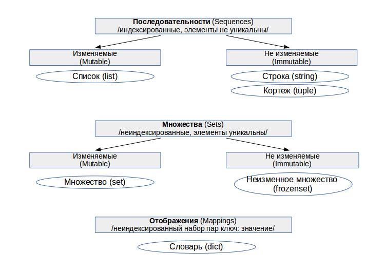
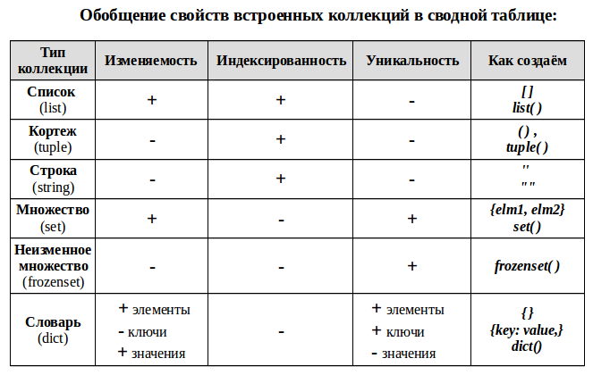

# Введение

**Коллекция в Python** — программный объект (переменная-контейнер), хранящая набор значений одного или различных типов, позволяющий обращаться к этим значениям, а также применять специальные функции и методы, зависящие от типа коллекции.

<figure><figcaption>
Классификация коллекций
</figcaption></figure>

<figure><figcaption>
Обобщение свойств коллекций
</figcaption></figure>

* **Индексированность** — каждый элемент коллекции имеет свой порядковый номер — индекс. Это позволяет обращаться к элементу по его порядковому индексу, проводить слайсинг («нарезку») — брать часть коллекции, выбирая исходя из их индекса.
* **Уникальность** — каждый элемент коллекции может встречаться в ней только один раз. Это порождает требование неизменности используемых типов данных для каждого элемента, например, таким элементом не может быть список.
* **Изменяемость** коллекции — позволяет добавлять в коллекцию новых членов или удалять их после создания коллекции.
