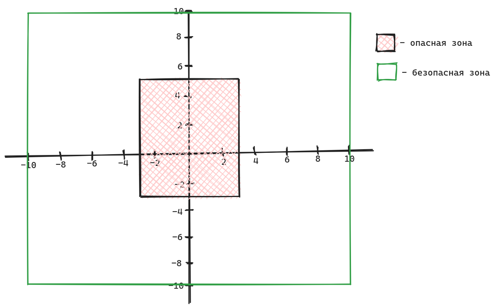

# Условные конструкции и их синтаксис

***

[**Практика**](uslovnye-konstrukcii-i-ikh-sintaksis.md#praktika)

***

* _Последовательная структура_ --- обычная последовательная программа
* _Структура принятия решения_ --- наличие выбора и разных блоков инструкций

**Последовательная структура**:

```
хочу пойти на улицу
надеваю шапку
надеваю куртку
надеваю ботинки
беру ключи
выхожу на улицу
```

**Структура принятия решения**:

```
хочу пойти на улицу
если холодно:
	надеваю шапку
	надеваю куртку
	надеваю ботинки
если тепло:
	надеваю футболку
	надеваю кеды
беру ключи
выхожу на улицу
```

* Операторы ветвления **if** (_если_) и **else** (_иначе_)

```python
a = int(input())
if a > 10: # если a > 10
	print(f'Число {a} больше 10')
else: # иначе, т.е. в любом другом случае
	print(f'Число {a} меньше, либо равно 10')

# блок if выполнится только если a > 10
# блок else выполнится в любом другом случае
# выполнится только один из блоков
# при этом программа может продолжится дальше
print("Программа продолжается")

программа
if <условие>:
	делаем раз # раз и два выполнится только если условие True
	делаем два
else:
	делаем три # выполнится только если условие False
# если условие True - выполняется блок if. Если нет - блок else
продолжение программы # не зависит от блока if/else
```

* Оператор **elif** : позволяет добавить дополнительные блоки инструкций

```python
программа

if <условие_1>: 
	делаем раз # выполнится если условие_1 True
elif <условие_2>:
	делаем два # выполнится если условие_1 False, а условие_2 True
else:
	делаем три # выполнится если условие_1 False и условие_2 False
продолжение программы # не зависит от блока if/else

# количество elif не ограничено
```

```python
score = int(input())
if score == 5:
	print('Ваша оценка - отлично')
elif score == 4:
	print('Ваша оценка - хорошо')
elif score == 3:
	print('Ваша оценка - удовлетворительно')
else:
	print('На пересдачу')
```

* Вложенные конструкции

```python
score = int(input())
if score == 5:
	print('Ваша оценка - отлично')
else:
	if score == 4:
		print('Ваша оценка - хорошо')
	else:
		if score == 3:
			print('Ваша оценка - удовлетворительно')
		else:
			print('На пересдачу')
```

* Оператор ветвления **match**
* Альтернатива if, когда мы проверяем на равенство одну переменную

```python
if season == "winter":
	print(12, 1, 2)
elif season == "spring":
	print(3, 4, 5)
elif season == "summer":
	print(6, 7, 8)
elif season == "autumn":
	print(9, 10, 11)
else:
	print(0)
```

```python
match season:
	case "winter":
		print(12, 1, 2)
	case "spring":
		print(3, 4, 5)
	case "summer":
		print(6, 7, 8)
	case "autumn":
		print(9, 10, 11)
	case _:
		print(0)
```

* **Тернарный оператор** --- упрощенная запись конструкции if/else
* **Автоматически возвращает результат** --- используется, когда нам нужно присвоить значение переменной
* Условие --- простое

```python
переменная = <значение_1> if <условие> else <значение_2>

значение_1 присваивается, если условие True. 
значение_2 присваивается, если условие False
```

```python
a = 5
b = "Четное" if a % 2 == 0 else "Нечетное"

# аналогично этой записи
if a % 2 == 0:
    b = "Четное"
else:
    b = "Нечетное"
```

***

### Практика

```
1. Напишите инструкцию if, которая присваивает значение 20
переменной y и значение 40 переменной z, если переменная x больше 100

2. Напишите инструкцию if, которая присваивает значение 0 переменной b
и значение 1 переменной c, если переменная a меньше 10

3. Напишите инструкцию if-else, которая присваивает значение 0 переменной
b, если переменная a меньше 10. В противном случае она должна
присвоить переменной b значение 99
```

```
Пользователь вводит с клавиатуры два числа.
4. Необходимо найти максимум из двух чисел и показать его на экран
5. Необходимо найти минимум из двух чисел и показать его на экран
6. В зависимости от выбора пользователя нужно показать сумму двух чисел,
разницу двух чисел, среднеарифметическое или произведение двух чисел
```

```
7. Площадь прямоугольника - это произведение его длины на его ширину.
Напишите программу, которая запрашивает длину и ширину двух прямоугольников.
Программа должна выводить пользователю сообщение о том, площадь какого
прямоугольника больше, либо сообщать, что они одинаковы.

8. Напишите программу, которая запрашивает у пользователя число в диапазоне
от 1 до 7. Эта программа должна показать соответствующий день недели, где
1 - понедельник, 2 - вторник, 3 - среда, 4 - четверг, 5 - пятница, 6 - суббота,
7 - воскресенье. Программа должна вывести сообщение об ошибке, если
пользователь вводит номер, который находится вне диапазона от 1 до 7.
```

```
9. Пользователь вводит с клавиатуры число. Необходимо проверить его на кратность 7.
Если число кратно, требуется вывести на экран число и надпись "Number is multiple 7".
Если число не кратно, выведите на экран число и надпись "Number is not multiple 7"
```

```
10. Напишите диалоговую программу, которая сначала познакомится с
пользователем, а затем поинтересуется его настроением.

В первой строке: Программа спрашивает имя, пользователь его вводит
Во второй строке: Программа спрашивает "Как настроение?", пользователь 
отвечает "хорошо" или "плохо". 
В третьей строке: На ответ "хорошо" следует вывести сообщение "Я рада за 
вас! Так держать, <имя_пользователя>!", в ответ на "плохо" - "Всё 
наладится, <имя_пользователя>!"
Дополнительно: реализуйте программу при помощи оператора match
```

```
11. Калькулятор времени.
Напишите программу, которая просит пользователя ввести количество секунд и работает
следующим образом.
- В минуте 60 секунд. Если число введенных пользователем секунд больше или равно 60,
то программа должна преобразовать число секунд в минуты и секунды.
- В часа 3600 секунд. Если число введенных пользователем секунд больше или равно 3600,
то программа должна преобразовать число секунд в часы, минуты и секунды.
- В дне 86.400 секунд. Если число введенных пользователем секунд больше или
равно 86.400, то программа должна преобразовать число секунд в дни, часы, 
минуты и секунды
```

```
12. Автоматизация безопасности

Группа исследователей собирается высадиться на остров невероятно ровной формы,
но разведка при помощи спутника выяснила, что на острове есть зона зыбучих
песков. Для повышения безопасности экспедиции было решено разработать систему
оповещения, которая предупредит исследователей об опасности. А для снижения
расходов на производство было решено заказать программное обеспечение.

Напишите программу, которая по координатам исследователя, будет сообщать о
безопасности в этой точке. Вводятся координаты исследователя — два
рациональных числа. Программа выводит одно из сообщений:

- Опасность! Покиньте зону как можно скорее!   
- Зона безопасна. Продолжайте работу.
- Вы вышли в море и рискуете быть съеденным акулой!

Например: ввод (-2.2, 4) вывод: “Опасность! Покиньте зону как можно скорее!”;
ввод (-3, 8.1) вывод: “Зона безопасна. Продолжайте работу.”; ввод (11, -12.1)
вывод: “Вы вышли в море и рискуете быть съеденным акулой!”
```

<figure><figcaption><p> <em>рисунок к задаче 12</em></p></figcaption></figure>

