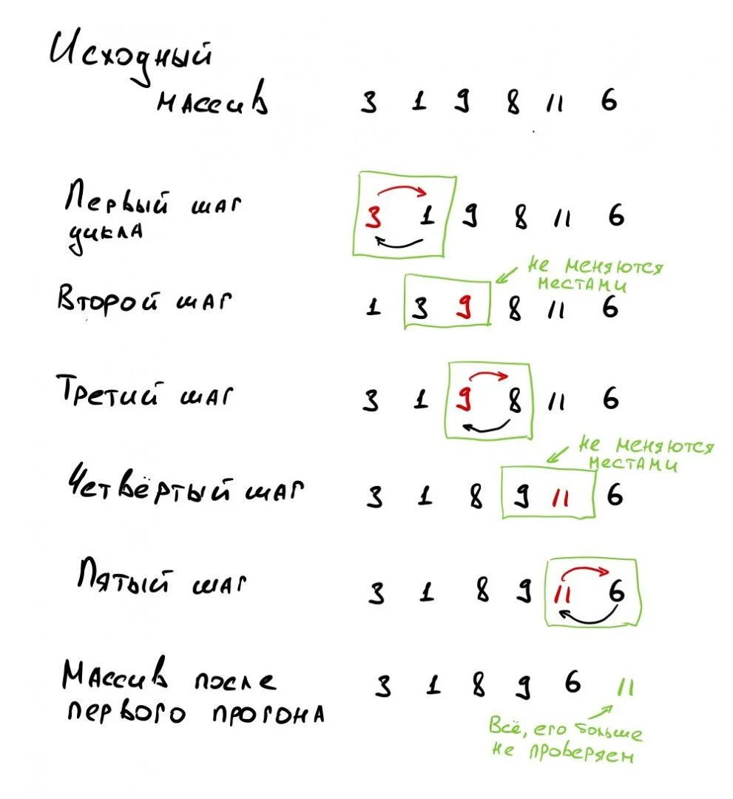
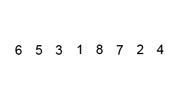

# Алгоритмы сортировки

**Сортировка данных** — это когда мы их упорядочиваем по какому-то признаку

Существуют десятки алгоритмов сортировки, каждый из которых хорош в чём-то своем. На одних легко объяснять принципы сортировки, другие хороши при работе с большими массивами, третьи оптимизированы по скорости, четвёртые — по числу процессорных циклов, компактности кода и т.д.

#### Зачем знать алгоритмы сортировки?

В обычной разработке вряд-ли понадобится реализовать сортировку самостоятельно — достаточно использовать встроенные в язык функции сортировки.

Но алгоритмы сортировки могут пригодится для специфичных задач, например при обработке потоковых данных или при работе с< огромными массивами на десятки и сотни тысяч элементов, когда нужны более экономичные алгоритмы.

Кроме этого, алгоритмы сортировки могут спросить на собеседовании — посмотреть, как кандидат мыслит, как пишет код, как именует переменные, как рассуждает об эффективности и т.п.

### Сортировка пузырьком (Bubble sort)

* Это самый простой, но не самый эффективный алгоритм — она полезна для понимания принципов сортировки, а также её элементы используются внутри других, более эффективных алгоритмов
* На каждом шаге мы находим наибольший элемент из двух соседних и ставим этот элемент в конце пары. Получается, что при каждом прогоне цикла бОльшие элементы будут всплывать к концу массива, как пузырьки воздуха — отсюда и название

Алгоритм выглядит так:

1. Берём самый первый элемент массива и сравниваем его со вторым. Если первый больше второго — меняем их местами с первым, если нет — ничего не делаем.
2. Затем берём второй элемент массива и сравниваем его со следующим — третьим. Если второй больше третьего — меняем их местами, если нет — ничего не делаем.
3. Проходим так до предпоследнего элемента, сравниваем его с последним и ставим наибольший из них в конец массива. Всё, мы нашли самое большое число в массиве и поставили его на своё место.
4. Возвращаемся в начало алгоритма и делаем всё снова точно так же, начиная с первого и второго элемента. Только теперь даём себе задание не проверять последний элемент — мы знаем, что теперь в конце массива самый большой элемент.
5. Когда закончим очередной проход — уменьшаем значение финальной позиции, до которой проверяем, и снова начинаем сначала.
6. Так делаем до тех пор, пока у нас не останется один элемент.

<figure><figcaption><p>Пример пузырьковой сортировки</p></figcaption></figure>

_Вычислительная сложность алгоритма:_

* В худшем случае: **O(n²)**
* В среднем случае: **O(n²)**

<figure><figcaption><p>Визуализация пузырьковой сортировки</p></figcaption></figure>

_**Реализация в коде:**_


```python
def bubble_sort(nums):
    # Мы устанавливаем swapped == True чтобы цикл выполнился хотя бы раз
    swapped = True
    while swapped:
        swapped = False
        for i in range(len(nums) - 1):
            if nums[i] > nums[i + 1]:
                # Меняем элементы
                nums[i], nums[i + 1] = nums[i + 1], nums[i]
                # Устанавливаем флаг == True, чтобы цикл повторился
                swapped = True


# Проверяем работу
random_list_of_nums = [5, 2, 1, 8, 4]
bubble_sort(random_list_of_nums)
print(random_list_of_nums)

# Output: [1, 2, 4, 5, 8]
```


### Быстрая сортировка

Быстрая сортировка используется гораздо чаще пузырьковой — либо в чистом виде, либо в алгоритмах на её основе

Алгоритм придуман Тони Хоаром в 1960 г., поэтому иногда её называют сортировкой Хоара. За основу он взял классическую пузырьковую сортировку и преобразовал её так:

1. На очередном шаге выбирается опорный элемент — им может быть любой элемент массива.
2. Все остальные элементы массива сравниваются с опорным и те, которые меньше него, ставятся слева от него, а которые больше или равны — справа.
3. Для двух получившихся блоков массива (меньше опорного, и больше либо равны опорному) производится точно такая же операция — выделяется опорный элемент и всё идёт точно так же, пока в блоке не останется один элемент.

#### Особенности алгоритма

Так как на третьем шаге мы разбиваем массив на два и для каждой части делаем то же самое, и так снова и снова — это значит, что в нём используется **рекурсия** — функция вызывает саму себя, при этом ей нужно держать в памяти все предыдущие этапы.

Это один из самых быстрых алгоритмов, когда мы заранее ничего не знаем про массивы, с которыми придётся работать

#### Выбор опорного элемента

В зависимости от реализации алгоритма есть разные способы выбора:

* Первый элемент — в первых версиях быстрой сортировки Хоар выбирал опорным элементом первый элемент массива
* Средний элемент — тот, который физически стоит посередине массива
* Последний элемент
* Случайный элемент

Есть ещё много других техник выбора — они применяются, когда программист точно знает, с какими массивами придётся работать: немного упорядоченными или когда всё вразнобой

<figure><figcaption><p>Быстрая сортировка</p></figcaption></figure>


```python
def partition(nums, low, high):
    # Мы выбираем средний элемент в качестве опорного
    # Это может быть первый, последний или случайный элемент
    pivot = nums[(low + high) // 2]
    i = low - 1
    j = high + 1
    while True:
        i += 1
        while nums[i] < pivot:
            i += 1

        j -= 1
        while nums[j] > pivot:
            j -= 1

        if i >= j:
            return j
    # Если элемент в точке i (слева от опорного элемента) больше, чем элемент
    # в точке j (справа от опорного элемента), то меняем их местами
        nums[i], nums[j] = nums[j], nums[i]


def quick_sort(nums):
    # Создаем вспомогательную функцию, которая вызывается рекурсивно
    def _quick_sort(items, low, high):
        if low < high:
            # Это индекс после опорного элемента, где наши списки разделены 
            split_index = partition(items, low, high)
            _quick_sort(items, low, split_index)
            _quick_sort(items, split_index + 1, high)

    _quick_sort(nums, 0, len(nums) - 1)


# Проверяем работу
random_list_of_nums = [22, 5, 1, 18, 99]
quick_sort(random_list_of_nums)
print(random_list_of_nums)

# Output: [1, 5, 18, 22, 99]
```


_Вычислительная сложность алгоритма:_

* В худшем случае: **O(n²)**
* В среднем случае: **O(n\*log n)**

### Сортировка слиянием

Скорость быстрой сортировки сильно возрастает, если неверно выбрать опорный элемент

Чтобы не столкнуться с этой проблемой, используют _сортировку слиянием_

#### Принцип работы

Делим массив пополам, каждый из них сортируем слиянием, потом соединяем оба массива. Каждый разделенный массив тоже нарезаем на два массива до тех пор, пока в каждом не окажется по одному элементу. Здесь тоже используется рекурсия.

Представим алгоритм по шагам:

1. Исходный массив: \[4 2 5 1]
2. Делим пополам: \[4 2] ←→ \[5 1] (у нас появилось два новых массива, значит, к ним применяем тоже сортировку слиянием)
3. Делим пополам **первый массив**: \[4] ←→ \[2]
4. Раз в каждом по одному элементу, то сортируем и склеиваем в один: \[2 4]
5. Делим пополам **второй массив**: \[5] ←→ \[1]
6. Раз в каждом по одному элементу — сортируем и склеиваем в один: \[1 5]
7. К нам вернулись два отсортированных подмассива, а значит, нам нужно их отсортировать и склеить в один.
8. Сравниваем первые элементы: 1 и 2. Единица меньше двух, значит, в итоговый массив записываем 1, и у нас остаются два массива: \[2 4] и \[5]
9. Сравниваем первые элементы: 2 и 5. Двойка меньше пяти, значит, в итоговый массив записываем 2, и у нас остаются два массива: \[4] и \[5]
10. Точно так же сравниваем первые элементы до тех пор, пока в обоих массивах не исчезнут все элементы. Как только это произойдёт — массив отсортирован

<figure><figcaption><p>Сортировка слиянием</p></figcaption></figure>

Главное **преимущество** сортировки слиянием — она работает всегда с одной и той же скоростью на любых массивах. Допустим, у нас есть два массива: в одном числа в случайном порядке, а в другом —  уже отсортированные числа, но первое и последнее поменяны местами. И в том и в другом случае сортировка слиянием покажет **одно и то же время**: ей всё равно, какие данные обрабатывать.&#x20;


```python
def merge(left_list, right_list):
    sorted_list = []
    left_list_index = right_list_index = 0

    # Мы часто используем длину списка, поэтому введем переменные
    left_list_length, right_list_length = len(left_list), len(right_list)

    for _ in range(left_list_length + right_list_length):
        if left_list_index < left_list_length and right_list_index < right_list_length:
            # Мы проверяем, какое значение с начала каждого списка меньше
            # Если из левого списка меньше, то мы добавляем его в отсортированный список
            if left_list[left_list_index] <= right_list[right_list_index]:
                sorted_list.append(left_list[left_list_index])
                left_list_index += 1
            # Если из правого — добавляем его
            else:
                sorted_list.append(right_list[right_list_index])
                right_list_index += 1

        # Если мы дошли до конца левого списка, добавляем элементы правого списка
        elif left_list_index == left_list_length:
            sorted_list.append(right_list[right_list_index])
            right_list_index += 1
        # Если мы дошли до конца правого списка, добавляем элементы из левого
        elif right_list_index == right_list_length:
            sorted_list.append(left_list[left_list_index])
            left_list_index += 1

    return sorted_list


def merge_sort(nums):
    # Если список состоит из одного элемента — возвращаем его    
    if len(nums) <= 1:
        return nums

    # Используем целочисленное деление для получения среднего индекса
    mid = len(nums) // 2

    # Сортируем и "склеиваем" каждую половину
    left_list = merge_sort(nums[:mid])
    right_list = merge_sort(nums[mid:])

    # Объедняем сортированные списки в один
    return merge(left_list, right_list)


# Проверяем работу
random_list_of_nums = [120, 45, 68, 250, 176]
random_list_of_nums = merge_sort(random_list_of_nums)
print(random_list_of_nums)

# Output: [45, 68, 120, 176, 250]
```


_Вычислительная сложность алгоритма:_

* В худшем случае: **O(n\*log n)**
* В среднем случае: **O(n\*log n)**
