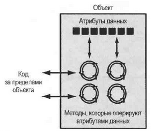

# Введение в ООП

### Парадигмы программирования

Существует несколько парадигм программирования, вот основные:

1. **Императивное программирование** — программа это последовательность инструкций, которые выполняются по порядку

```python
def sum_list(lst):
    total = 0
    for num in lst:
        total += num
    return total
```

2. **Функциональное программирование** — программа это набор функций, которые работают с данными используя входные и выходные параметры

```python
import functools

def sum_list(lst):
    return functools.reduce(lambda x, y: x + y, lst)
```

3. **Объектно-ориентированное программирование** — программа представляется в виде объектов, которые содержат данные и методы для их обработки. Основная идея — объекты являются сущностями, которые существуют самостоятельно и могут взаимодействовать друг с другом

```python
class List:
    def __init__(self, lst):
        self.lst = lst
    
    def sum(self):
        total = 0
        for num in self.lst:
            total += num
        return total

# Создаем экземпляр класса
my_list = [1, 2, 3, 4, 5]
my_obj = List(my_list)

# Вызываем метод sum()
result = my_obj.sum()
print(result)
```

Иногда рассматривают ещё _методы программирования_. И выделяют два основных метода: процедурный и объектно-ориентированный.

_Процедурное программирование_ — метод написания программного обеспечения, в центре внимания которой находятся процедуры или действия, происходящие в программе.&#x20;

Основой _объектно-ориентированного программирования_ служат объекты, объединяющие данные и функции.

### Понятие ООП

**Объект** — это программная сущность, которая содержит данные и процедуры. Находящиеся внутри объекта данные называются **атрибутами данных.** Выполняемые объектом процедуры называются методами**. Методы объекта** —  это функции, которые выполняют операции с атрибутами данных.

То есть, объект можно представлять как автономную единицу, которая состоит из атрибутов данных и методов, которые оперируют атрибутами данных. Методы могут напрямую не взаимодействовать с атрибутами, но всегда совершают какое-либо действие своего объекта.

<figure><figcaption><p>Объект, атрибуты и методы</p></figcaption></figure>

Например, у объекта "автомобиль" есть атрибуты: марка, модель,  год выпуска и методы : припарковать, посигналить, открыть дверь.&#x20;

_**Интерактив:**_

* Приведите примеры объктов из реальной жизни с атрибутами и методами. Как с ними можно взаимодействовать? Как можно изменить атрибуты объекта?

Принцип **инкапсуляции** — объединение данных и программного кода в одном объекте. Включает в себя **сокрытие данных** — атрибуты объекта можно изменять только при помощи методов, которые мы определили и за их пределами доступа к атрибутам нет.

Когда меняются данные объекта, программист меняет реализацию методов этого объекта. При этом снаружи взаимодействие с объектом остается прежним. Например, есть объект "велосипед" и у него метод "затормозить". Мы можем поменять внутреннее устройство тормоза, но внешний интерфейс — нажатие ручки тормоза, лучше оставить прежним.

_**Пример объекта из повседневной жизни**_

Пусть будильник — программный объект. У него есть атрибуты:

```python
current_second # текущая секунда, значение в диапазоне 0-59
current_minute # текущая минута, значение в диапазоне 0-59
current_hour # текущий час, значение в диапазоне 1-12
alarm_time # время сигнала, допустимые час и минута
alarm_is_set # будильник включен - истина или ложь
```

* Мы видим, что атрибуты — это всего лишь значения они определяют состояние, в котором будильник находится в настоящее время. Мы, как пользователи, не можем _напрямую манипулировать этими атрибутами данных_, необходимо применить один из методов объекта
* Некоторые методы объекта "будильник"

```python
set_time # задать время
set_alarm_time # задать время сигнала
set_alarm_on # включить будильник
set_alarm_off # выключить будильник
```

* При помощи этих методов мы, пользователи, можем манипулировать атрибутами объекта "будильник".  То есть эти методы "выставлены наружу" и являются _**публичными**_
* Есть также _**приватные методы**_ — закрытые от внешних сущностей (нас) и являющиеся частью приватного, внутреннего устройства объекта.

```python
# приватные методы
increment_current_second() # прирастить текущую секунду
increment_current_minute() # прирастить текущую минуту
increment_current_hour() # прирастить текущий час
sound_alarm() # подать звуковой сигнал
```

_**Интерактив:**_

* Что такое объект?
* Что такое инкапсуляция?
* Почему внутренние данные объекта обычно скрыты от внешнего программного кода?
* Что такое публичные методы? Что такое приватные методы?

### Классы
