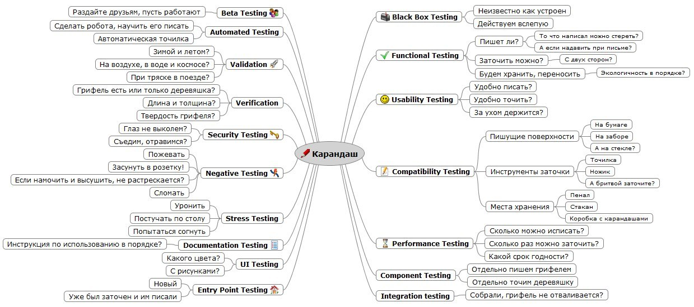

# Основы тестирования

### Введение

* Для того чтобы убедиться, что что-то в нашем мире работает, это нужно **протестировать**
* Также и в программировании — можно утверждать, что программа работает только тогда, когда её протестировали
* Протестировать можно **всё, что угодно:**

<figure><figcaption><p>Тесты для карандаша</p></figcaption></figure>

* Тестирование бывает разных типов, мы остановимся на том, которым занимается каждый разработчик: **модульное тестирование**

### Модульное тестирование

* Модульное тестирование (**unit**-тестирование) — тип тестирования, при котором проверяются отдельные компоненты программы: функции и модули

```python
# рассмотрим пример тестирования функции
def multiply_numbers(a, b):
    return a * b
    
print(multiply_numbers(2, 3)) # тестируем функцию multiply_numbers

print(multiply_numbers(2, 4) == 8) # тоже тестируем

print("test ok" if multiply_numbers(2, 5) == 10 else "test fail") # тоже тестируем

def test_multiply_numbers(): # и так тестируем
    print(multiply_numbers(2, 6) == 12)
    print(multiply_numbers(2, 4) == 8)
    print(multiply_numbers(2, 5) == 10)
    print(multiply_numbers(0, 0) == 0)
    print(multiply_numbers(-4, -5) == 20)
    
    
def test_multiply_numbers(): # и так тоже
    print("test 1 ok" if multiply_numbers(2, 6) == 12 else "test 1 fail")
    print("test 2 ok" if multiply_numbers(2, 4) == 8 else "test 2 fail")
    print("test 3 ok" if multiply_numbers(2, 5) == 10 else "test 3 fail")
    print("test 4 ok" if multiply_numbers(0, 0) == 0 else "test 4 fail")
    print("test 5 ok" if multiply_numbers(-4, -5) == 20 else "test 5 fail")
    
```

* Одна из популярных  практик программирования называется **Test Driven Development (TDD)**, когда сначала пишутся тесты, а потом код. Такой подход сокращает общее время разработки и уменьшает зависимость от отладки
* _**Практика:**_ напишите функцию сложения двух чисел. Сначала напишите тестовую функцию, как в примере выше.

