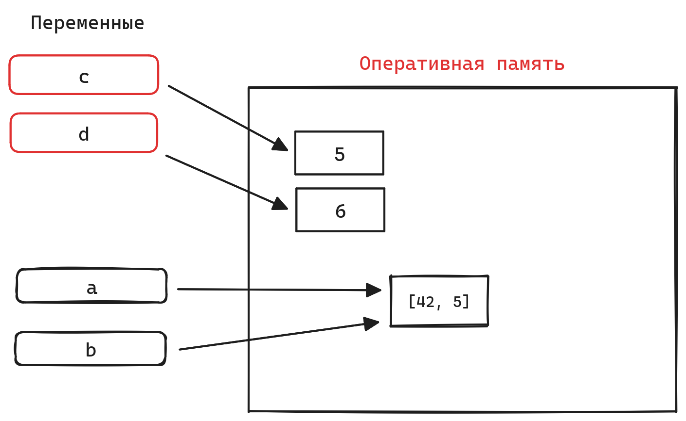

# Изменяемые и неизменяемые объекты в Python\*

* Переменные в Python --- это ссылки на объекты в памяти компьютера
* Каждый объект в памяти имеет:
  * _идентификатор_ : адрес в оперативной памяти компьютера
  * _тип_ : строка, число, список и т.д
  * _значение_

```python
name = "Sergey"
id(name) # узнать идентификатор объекта
~# 140291548567088
```

* В момент определения переменной создаётся объект в памяти компьютера, затем ему присваивается ссылка --- имя переменной
* Объекты могут быть изменяемые(например: списки) и неизменяемые(например: строки, числа)

```python
c = 5 # c - ссылка на объект число 5
d = c # создадим ещё одну ссылку на этот же объект

c += 1 # добавим 1 к c - теперь c ссылаетcя на ДРУГОЙ объект: число 6
c == 6 # True
d == 5 # True

a = [42] # a - ссылка на объект - список из одного элемента
b = a # создадим еще одну ссылку на этот же объект

a.append(5) # изменим ОБЪЕКТ - добавим элемент
a == [42, 5] # True
b == [42, 5] # True - b тоже изменилась, т.к. список это изменяемый объект
```

_В итоге мы получим такую картину: в памяти у нас остался один объект: список и два объекта --- целые числа_&#x20;

<figure><figcaption></figcaption></figure>

* Оператор is сравнивает объекты по адресам, т.е. проверяет, _СОВПАДАЮТ_ ли объекты. Оператор == сравнивает _РАВНЫ_ ли объекты

```
Практика:
Повторите код из занятия. Проверьте, совпадают ли a и b, c и d.
На каждом этапе программы посмотрите идентификаторы объектов.
```
