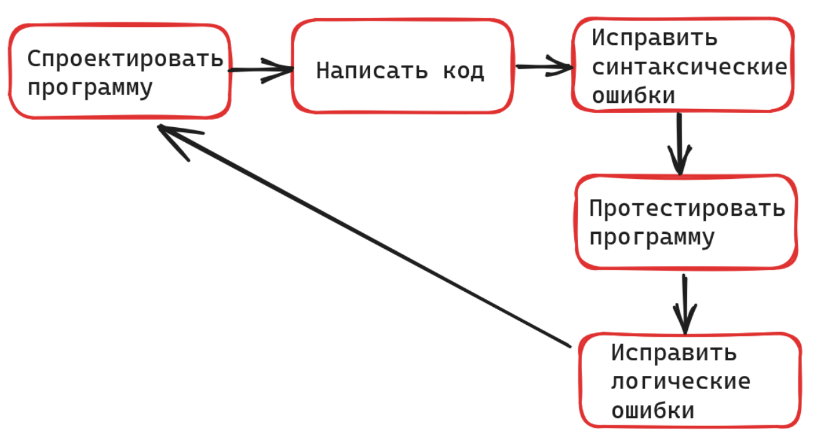

# Основные определения. Простые типы данных

***

[**Практика**](osnovnye-opredeleniya.-prostye-tipy-dannykh.md#praktika)

***

* **Переменная**

```python
num = 5 # определили переменную num
# num это ссылка на объект в памяти компьютера (объект число 5)
num = 10 # переопределили переменную num
# теперь num это ссылка на объект число 10 в памяти компьютера
num - переменная
10 - значение переменной num

```

* **Оператор и операнды**

```python
a = 10 > 5
# 10 и 5 это операнды
# > это оператор
```

```python
# операторы сравнения
<, >, ==, !=, <=, >=

# логические операторы
and, or, not

# арифметические операторы
+ - % // / * ** 

# оператор присваивания
a = 5
```

* **Присваивание**

```python
a, b = 5, 10
# то же самое что a = 5, b = 10
# это называется множественным присваиванием

a, b = b, a 
# меняем переменные, теперь a = 10, b = 5
# удобный способ поменять значения переменных

a = b = c = 0
# создаем три переменные a b и c и всем присваиваем значение 0

a = 5
# сокращенная запись присваивания с арифметической операцией
a += 1 # 6, эквивалентно a = a + 1
a %= 2 # 0
a -= 5 # -5
```

* **Типы данных**

```python
int # целое число, например 5
float # число с плавающей точкой, например 5.22
str # строка, пишется в кавычках, например "Это строка"
bool # булево (логическое) значение - True или False (правда или ложь)
type(a) # узнать тип объекта. объект передается аргументом
```

* **Комментарии в коде**

```python
# это комментарии в коде: оставляются для себя и для других разработчиков
# оставлять можно в любой части кода при помощи #
# поясняют части кода. Интерпретатор их игнорирует
```

* **Отладка** --- процесс исправления ошибок(багов) в коде
* **Рефакторинг** --- процесс оптимизации рабочего кода (код работает верно, но мы хотим его улучшить --- занимаемся рефакторингом)
* **Функция** --- инструкция в программе

```python
print()
# обязательно название и две круглых скобки - иначе функция не будет вызвана
```

* **Аргументы функции**: позиционные и ключевые

```python
print("Hello!")
# "Hello!" это аргумент функции print(). Его тип - строка.

print("Hello, ", "World", sep=' ', end="\n")
# аргументы бывают позиционные: "Hello, ", "World"
# бывают ключевые - имеющие ключ: sep= и end=
```

Цикл проектирования программы:&#x20;

<figure><figcaption></figcaption></figure>

### Практика

```
1. Напишите программу, которая вычисляет среднюю скорость на маршруте.
Время равно 5 часам, расстояние 40 км. Выведите среднюю скорость на экран.
2. Напишите программу, которая вычисляет длину гипотенузы треугольника,
катеты которого равны 10 и 20. Выведите на экран.
```
