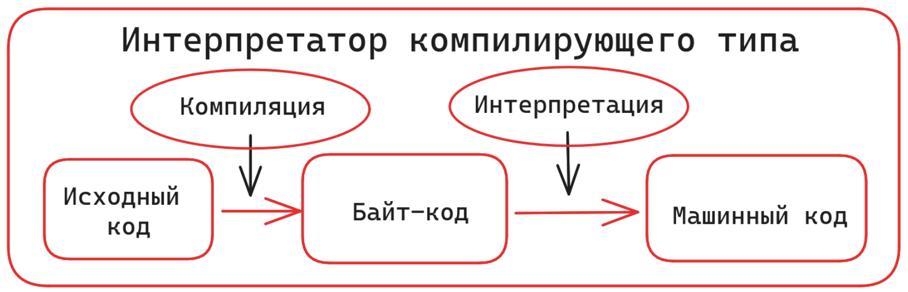

# Особенности языка Python

**Python** — высокоуровневый, интерпретируемый язык программирования

* **Особенности**:
  * синтаксис проще большинства ЯП
  * открытый и мультиплатформенный
  * скорость ниже многих ЯП

**Версии языка**

* СPython — официальная реализация
* CPython является _интерпретатором компилирующего типа_ — таким образом удаётся частично нивелировать недостаток в скорости, связанный с интерпретацией:&#x20;

<figure><figcaption>
CPython —  <em>интерпретатор компилирующего типа</em>
</figcaption></figure>

* Другие реализации: PyPy (обладает высокой скоростью), Anaconda, JPython, IronPython, Brython.
* Версии Python 2 и Python 3 несовместимы

_Дополнительные материалы_:\
[Реализации языка Python](https://docs-python.ru/tutorial/zachem-izuchat-python/realizatsii/)
