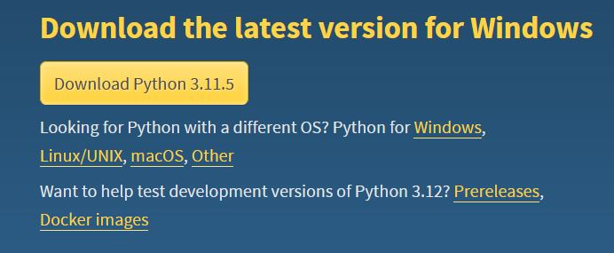
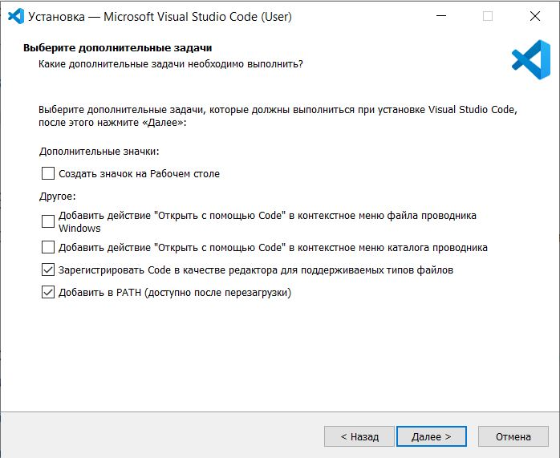
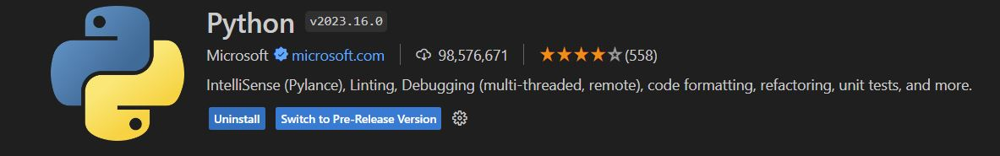
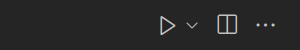
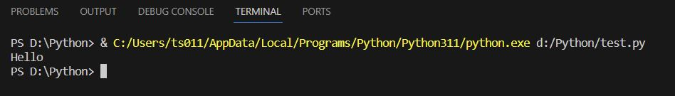
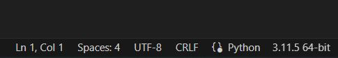
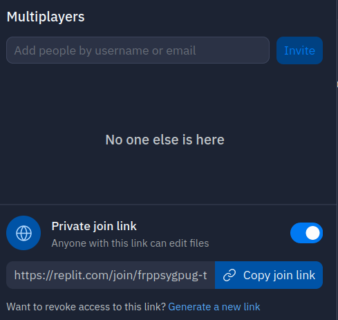

# Установка. Использование

***

[**VS Code на Windows**](ustanovka.-ispolzovanie.md#vs-code)\
[**replit.com**](ustanovka.-ispolzovanie.md#replit)

***

Для программирования на Python нам понадобится интерпретатор:\
[**Скачать и установить интерпретатор Python**](https://www.python.org/downloads/)

<figure><figcaption></figcaption></figure>

* В принципе, с кодом уже можно работать — вместе с интерпретатором установится простой редактор кода. Файлы с кодом на Python должны иметь расширение _.py_
* Код можно писать даже в блокноте. Затем сохранять его и запускать в интерпретаторе.
* Однако это не очень удобно — нет подсветки синтаксиса, автодополнения, нужно запускать редактор и интерпретатор и т.д. Гораздо удобнее, чтобы все необходимое было в одной программе.
* Так придумали IDE (Integrated Development Environment).
* IDE — это среда программирования, выполняющая функции редактора кода, интерпретатора и многие другие. Смысл IDE — она облегчает жизнь разработчика.

IDE очень много. Если вы новчичок, лучше остановиться на одной из этих:

* VScode
* PyCharm
* Sublime Text

Программировать также можно онлайн, при помощи веб-сервисов:

* [**replit**](https://replit.com/\~): хороший функционал, требуется регистрация.
* [**online python**](https://www.online-python.com/) : без регистрации, минимум необходимых функций.

Во всех IDE есть поле редактора кода и поле консоли. Код пишется в редакторе, а запускается в консоли. Результат отображается при помощи функции print(). Напишите и запустите программу:

```python
print("Hello, World!")
# Hello, World!
```

### VS Code

Рассмотрим этапы установки и запуска IDE VS Code на Windows:

1.  [**Скачать и установить VS Code**](https://code.visualstudio.com/)

    * Обратите внимание на галочку при установке "Добавить в PATH"

    <figure><figcaption></figcaption></figure>
2. В VS code нужно установить расширение Python:&#x20;

<figure><figcaption></figcaption></figure>

* это можно сделать создав файл с расширением _.py_ — тогда программа сама предложит установить расширение
* либо нажать **Ctrl + Shift + X** — это горячая клавиша открытия списка расширений и выбрать Python — как на скриншоте

3. Перезагрузить VS Code
4. Открыть папку, в которой вы будете работать (_File -> Open Folder_)
   * имена в пути к файлу и имя самого файла должны быть написаны на латинице без пробелов
5. Создать файл с расширением `.py`. В нём вы можете писать код.
   * открыть файловый менеджер (Explorer) можно нажатием **Ctrl + Shift + E**
6. Программа предложит скачать интерпретатор Python. Если этого не произошло, напишите в консоли: _python_ и нажмите Enter. Установите интерпретатор. Перезапустите VSCode.
7. Чтобы запустить код нажмите треугольник:\
   
8. Результат работы программы вы увидите в терминале в нижней части экрана:&#x20;

<figure><figcaption></figcaption></figure>

* **Ctrl + \`** — открыть терминал
* **Ctrl + 1** — обратно во вкладку редактора
* На скриншоте желтым — путь к вашему интерпретатору на компьютере. Белым — путь к вашему файлу _.py_. Вместе два этих пути составляют команду в терминале, которая запускает ваш файл и она автоматически запускается при нажатии на треугольник
* Находясь в терминале, вы можете вернуться к последней команде нажатием стрелки вверх и запустить файл повторно или отредактировать команду и, например, запустить другой файл.
* Справа внизу информация о том, как редактор работает с файлом — в частности какой язык в файле используется (он определяется автоматически — _Python_ на скриншоте) и версия интерпретатора — 3.11.5.64-bit. Вы можете нажать на неё и выбрать другую версию, если у вас установлено несколько.

<figure><figcaption></figcaption></figure>

***

* Консолью VS Code можно пользоваться как командной строкой — переходить в папки, создавать их, запускать файлы и т.д. (при условии, что VS Code запущен от имени администратора) — т.е. использовать практически весь функционал компьютера, только без графического интерфейса.
* При возникновении ошибок убедитесь, что вы запускаете файл с расширением _.py_, что выбран интерпретатор Python (это делается автоматически, но вы проконтролируйте) и установлено расширение Python для VS Code. Перезагрузите VS Code.

### replit

* Это **онлайн-IDE**, позволяющая работать прямо в браузере
* Пользователи создают свои онлайн-проекты и пишут код. Онлайн проекты называются _Repls_ (_"Реплы"_)
* _Преимущества_:
  * Вам не нужно ничего скачивать и настраивать — все настроено на серверах сервиса
  * Поддержка шаблонов для разных языков программирования. Пользователи могут создавать свои шаблоны — заготовки кода, которые потом переиспользуют для разных проектов
  * Вы можете отправлять код друг другу и вносить правки, общаться в чате
  * Поддерживает загрузку проектов с локальной машины и с github
  * Есть бесплатная версия
* _Недостатки_:
  * Не подходит для очень больших проектов — в бесплатной версии серьезное ограничение на использование мощностей серверов
  * Деплой входит только в платные подписки

Это делает сервис очень удобным для обучения. Также это хороший способ познакомится с инфраструктурой разработки.

**Быстрый старт**:

1. **Зарегистрируйтесь** на [**replit.com**](https://replit.com/\~)
2. **Создайте Repl** (кнопка _Create Repl_)
   * Шаблон (_Template_) — Python
   * Название (_Title_) — любое
   * Приватность (_Privacy_) — Public
   * _Create Repl_
3. Вы попадете в редактор, где можно писать код.
4. Слева _файловый менеджер_ — автоматически создается файл main.py — это собственно файл, где будет код. И packager files — это дополнительные файлы менеджера зависимостей — они понадобятся, если наш проект будет расти и мы будем устанавливать дополнительные пакеты.
5. Справа _консоль_, где код выполняется. Также соседней вкладкой в правом окне открывается Shell — командная оболочка, если понадобится написать команду операционной системе.
6. Напишите код и запустите — _Ctrl + Enter_, либо кнопка _Run_. Вы увидете результат в консоли.
7. Одно из преимуществ replit — это возможность работать над одним проектом вместе. Попробуйте внести изменения в мой репл по ссылке:
   * [https://replit.com/join/frppsygpug-timosii](https://replit.com/join/frppsygpug-timosii)
8. Чтобы самому создать такую ссылку и пригласить кого-то посмотреть и отредактировать свой код, нажмите _+Invite_ справа вверху. И переключите тумблер на _Private join link_ — так, как показано на скриншоте:

<figure><figcaption></figcaption></figure>

9. Теперь остаётся нажать _Copy join link_ и отправить ссылку друзьям или преподавателю!

### Практика

```
1. Установите VSCode, запустите код на Python. Узнайте как менять тему,
установите расширение с темами. Выберите подходящую. 
2. Познакомьтесь с сервисом replit.com, зарегистрируйтесь, создайте свой проект.
Пригласите в проект своего преподавателя или коллегу, отправив приватную ссылку на Repl.
```

_Дополнительные материалы:_\
[Переменные окружения](https://ru.wikipedia.org/wiki/%D0%9F%D0%B5%D1%80%D0%B5%D0%BC%D0%B5%D0%BD%D0%BD%D0%B0%D1%8F\_%D1%81%D1%80%D0%B5%D0%B4%D1%8B) — будьте аккуратны при изучении переменных окружения, не меняйте их, если не уверены в результате\
[Горячие клавиши VS Code](https://habr.com/ru/articles/718662/)
