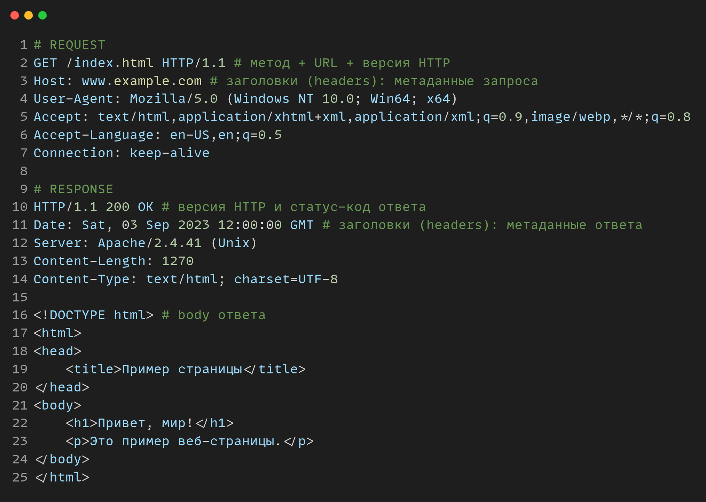
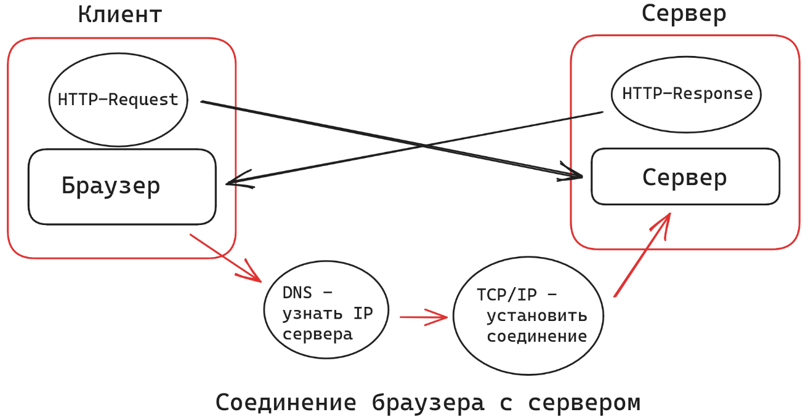

# Введение в web-программирование

* Основа веба: это взаимодействие клиент-сервер
  * **клиент** — запрашивает информацию
  * **сервер** — предоставляет информацию в ответ на запрос клиента
  * _пример_: браузер и сервер сайта. Браузер запрашивает информацию, сервер сайта предоставляет информацию в ответ на запрос
* **HTTP**: протокол общения между клиентом и сервером
  * **Протокол** — набор правил. Наличие общих правил позволяет унифицировать обмен информацией — все могут общаться со всеми
* Структура HTTP:
  * запрос (**request**): метод запроса + URL + заголовки (headers) + тело (body)
  * ответ (**response**): status-code (200 OK, 404 not found и др.) + заголовки (headers) + тело (body)
* Некоторые методы запроса:
  * **GET** — взять информацию с сервера. Самый распространенный для пользователей
  * **POST** — добавить информацию на сервер
  * **UPDATE** — обновить информацию на сервере
  * **DELETE** — удалить информацию с сервера

<figure><figcaption>
<em>Пример HTTP запроса на сайт www.example.com/index.html и ответа с него.</em>  <em>Результат</em> — <em>загруженная HTML страница</em>
</figcaption></figure>

<figure><figcaption>
<em>Клиент-серверное взаимодействие на примере загрузки web-страницы</em>
</figcaption></figure>

&#x20;
